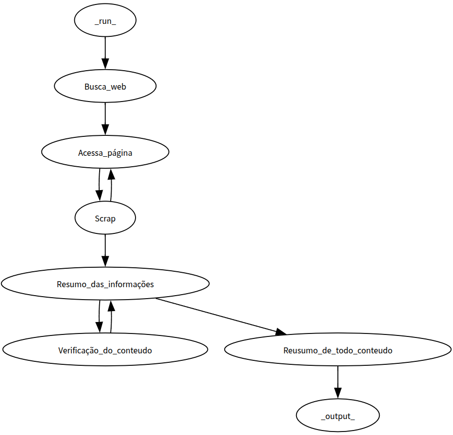
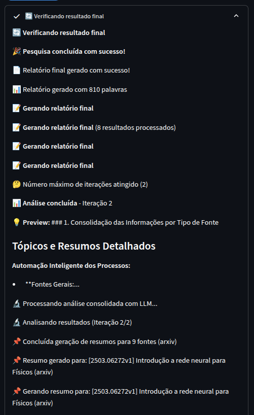

# Deep Research Service

Um sistema avançado de pesquisa profunda usando LangGraph com múltiplos agentes especializados e interface Streamlit em tempo real.

## 🌟 Características

- **Múltiplos Agentes Especializados**: Agentes dedicados para diferentes tipos de pesquisa
- **Interface em Tempo Real**: Acompanhe o progresso da pesquisa em tempo real
- **Suporte a Múltiplos LLMs**: OpenAI GPT e modelos Ollama locais
- **Pesquisa**: Google Search, Wikipedia
- **Relatórios Estruturados**: Síntese inteligente com principais descobertas

## 🔧 Ferramentas de Pesquisa Open Source

### Fontes de Busca
- **Google Search**: Fallback usando googlesearch-python (sem API paga)
- **Wikipedia**: Conhecimento enciclopédico (português/inglês)


### Processamento de Conteúdo
- **Newspaper3k**: Extração inteligente de artigos
- **BeautifulSoup**: Parsing HTML robusto
- **Feedparser**: Processamento de feeds RSS/Atom
- **Requests**: HTTP client confiável

## 🏗️ Arquitetura

### Agentes Especializados

1. **Web Search Agent** 🌐
   - Google Search como fallback (sem API)
   - Busca acadêmica no arXiv
   - Queries relacionadas automáticas

2. **Knowledge Agent** 📚
   - Wikipedia multilíngue (PT/EN)
   - Conhecimento estruturado e enciclopédico
   - Informações fundamentais sobre o tópico

3. **Content Analyzer Agent** 🔎
   - Newspaper3k para extração de artigos
   - BeautifulSoup para parsing HTML
   - Análise inteligente de conteúdo

4. **Synthesis Agent** 📋
   - Síntese inteligente de todas as informações
   - Geração de relatório estruturado
   - Extração de principais insights

### Fluxo de Trabalho (LangGraph)


## 🚀 Instalação e Uso

### Pré-requisitos

```bash
pip install -r requirements.txt
```

### Configuração

1. **Para OpenAI**: Obtenha uma chave API em https://platform.openai.com
2. **Para Ollama**: Instale o Ollama localmente
   ```bash
   # Instalar Ollama
   curl -fsSL https://ollama.ai/install.sh | sh
   
   # Baixar um modelo (exemplo)
   ollama pull llama3.1
   ```

### Executar a Aplicação

```bash
streamlit run frontend/app.py
```

A aplicação estará disponível em `http://localhost:8501`

```bash
python backend/main.py
```

## 🎯 Como Usar

1. **Configurar LLM**:
   - Escolha entre OpenAI ou Ollama na sidebar
   - Insira as credenciais necessárias
   - Selecione o modelo desejado

2. **Iniciar Pesquisa**:
   - Digite sua consulta de pesquisa
   - Ajuste a profundidade se necessário
   - Clique em "Iniciar Pesquisa"

3. **Acompanhar Progresso**:
   - Veja o progresso em tempo real
   - Acompanhe as atividades de cada agente
   - Monitore os resultados sendo coletados

4. **Analisar Resultados**:
   - Principais descobertas destacadas
   - Relatório final estruturado
   - Estatísticas da pesquisa

## 📊 Exemplo de Uso

### Consulta
```
"Impacto da inteligência artificial no mercado"
```



## 🆓 Vantagens do Approach Open Source

✅ **Zero Custos de API**: Não precisa pagar por serviços de busca  
✅ **Sem Rate Limits**: Não há limitações de requisições por minuto  
✅ **Privacidade**: Dados não são enviados para serviços proprietários  
✅ **Controle Total**: Pode modificar e adaptar as ferramentas  
✅ **Fontes Diversificadas**: Múltiplas fontes independentes  
✅ **Resistente a Falhas**: Se uma fonte falhar, outras continuam funcionando

```
deep-research-service/
├── backend 
├──├── deep_research_agent.py  #Agentes especializados
├──├── main.py   # Configurações da API
├── frontend  
├──├── app.py    # Streamlit
├── requirements.txt # Dependências Python
└── README.md  # Este arquivo
```

## 🔧 Configurações Avançadas


### Personalização

- **Profundidade**: Ajuste o número de passos de pesquisa (1-10)
- **Modelos**: Suporte para diferentes modelos OpenAI e Ollama
- **Timeout**: Configurável para requests HTTP
- **Resultados**: Número máximo de resultados por busca


## 🔍 Funcionalidades Técnicas

### LangGraph Integration
- Estados tipados com dataclasses
- Fluxo de trabalho declarativo
- Execução assíncrona disponível
- Error handling robusto

### Streamlit Features
- Interface responsiva
- Atualizações em tempo real
- CSS customizado
- Componentes interativos